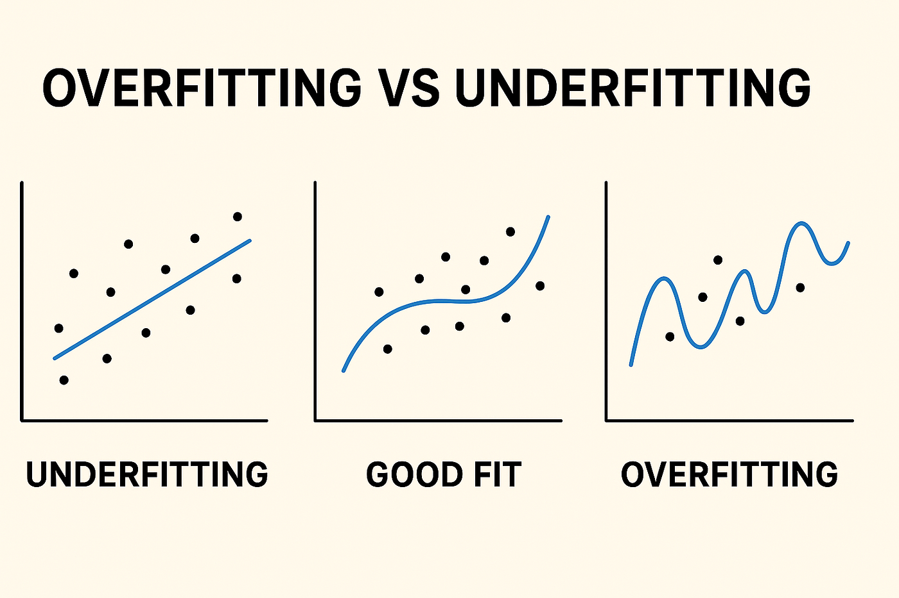

# Domain 1: Fundamentals of AI and ML (20% of Exam)

---

## Task 1.1: Basic AI Concepts and Terminologies

### Core Definitions

| Term | Definition | Example |
|------|-----------|---------|
| **Artificial Intelligence (AI)** | Broad field of computer science focused on creating systems that can perform tasks that normally require human intelligence | Virtual assistants, self-driving cars, chess engines |
| **Machine Learning (ML)** | Subset of AI where systems learn patterns from data without being explicitly programmed | Spam filters that learn from labeled emails |
| **Deep Learning** | Subset of ML that uses neural networks with many layers (deep neural networks) to learn complex patterns | Image recognition, speech-to-text |
| **Neural Networks** | Computing systems inspired by biological neural networks, consisting of layers of interconnected nodes (neurons) | Perceptrons, CNNs, RNNs |
| **Computer Vision** | AI field that enables computers to interpret and understand visual information from images/videos | Facial recognition, object detection, medical imaging |
| **Natural Language Processing (NLP)** | AI field focused on enabling computers to understand, interpret, and generate human language | Chatbots, translation, sentiment analysis |
| **Large Language Model (LLM)** | A type of deep learning model trained on vast amounts of text data that can understand and generate human-like text | GPT, Claude, Amazon Titan |
| **Generative AI (GenAI)** | AI that can create new content (text, images, code, audio, video) based on patterns learned from training data | ChatGPT, DALL-E, Amazon Bedrock models |
| **Agentic AI** | AI systems that can autonomously plan, reason, use tools, and take actions to accomplish complex multi-step goals with minimal human intervention | Amazon Bedrock Agents, AI coding assistants |

### Key Terminology Deep Dive

**Model** — A mathematical representation that has been trained on data to recognize patterns and make predictions or decisions.

> **Think of it like this:** A model is like a student who has studied thousands of examples. After studying, the student can answer new questions they've never seen before based on patterns they learned.

**Algorithm** — A set of rules or instructions that a model follows to learn from data. Examples: linear regression, decision trees, gradient descent.

> **Analogy:** The algorithm is the *study method* (flashcards, highlighting, practice tests). The model is the *knowledge* that results from studying. Different study methods (algorithms) work better for different subjects (data types).

**Training** — The process of feeding data into an algorithm so the model can learn patterns. The model adjusts its internal parameters to minimize errors.

> **Analogy:** Training is like teaching a child to identify animals. You show them hundreds of pictures of cats and dogs, and over time they learn to tell the difference. Each time they guess wrong, they adjust their internal "rules" about what makes a cat a cat.

**Inferencing** — Using a trained model to make predictions on new, unseen data. This is the "production" phase.

> **Analogy:** After the child has learned what cats and dogs look like (training), you show them a NEW photo they've never seen and ask "cat or dog?" — that's inferencing. Training happens once (or periodically); inferencing happens millions of times in production.

**Bias** — Systematic errors in model outputs that lead to unfair outcomes. Can stem from biased training data, algorithm design, or feature selection.

> **Real-world scenario:** Amazon once built a hiring tool trained on 10 years of resumes. Because most hires were male, the model learned to penalize resumes with the word "women's" (e.g., "women's chess club"). The model wasn't sexist — it learned from biased historical data.

**Fairness** — Ensuring AI systems treat all groups equitably and don't discriminate based on protected attributes (race, gender, age, etc.).

> **Key insight:** Fairness doesn't always mean "identical outcomes for all groups." It means the AI shouldn't systematically disadvantage any group for reasons unrelated to the task. A loan model can reject people with low credit scores — but it shouldn't reject people because of their zip code if that correlates with race.

**Fit** — How well a model captures patterns in data:

> **The Goldilocks Analogy:**
> - **Underfitting** = "too cold" — The model is too simple. Like drawing a straight line through a curved pattern. It misses the real pattern entirely. *Symptom: Bad accuracy on BOTH training and test data.*
> - **Overfitting** = "too hot" — The model is too complex. Like memorizing every single point including noise. It looks perfect on training data but fails on anything new. *Symptom: Great accuracy on training data, terrible on test data.*
> - **Good fit** = "just right" — The model captures the real patterns without memorizing noise.



### Notable ML Model Architectures

| Model | Full Name | Category | What It Does |
|-------|-----------|----------|--------------|
| **GPT** | Generative Pre-trained Transformer | Transformer / LLM | Autoregressive language model that predicts the next token. Pre-trained on massive text, then prompted or fine-tuned for generation, summarization, conversation. |
| **BERT** | Bidirectional Encoder Representations from Transformers | Transformer / NLU | Reads text bidirectionally (left-to-right AND right-to-left). Strong at understanding tasks: classification, question answering, named entity recognition. |
| **RNN** | Recurrent Neural Network | Deep Learning (sequence) | Processes sequential data by maintaining a hidden state across time steps. Used for time-series, speech, text. Variants: LSTM, GRU (solve vanishing gradient problem). |
| **ResNet** | Residual Network | Deep Learning (vision) | Deep CNN with skip connections that allow gradients to flow through 50–152+ layers. Dominant in image classification and object detection. |
| **SVM** | Support Vector Machine | Traditional ML | Finds the optimal hyperplane to separate classes with maximum margin. Uses kernel functions for non-linear boundaries. Works well on structured/tabular data. |
| **GAN** | Generative Adversarial Network | Generative (pre-LLM) | Two networks (generator + discriminator) trained in opposition. Generator creates synthetic data; discriminator distinguishes real from fake. Used for image/audio generation. |
| **XGBoost** | Extreme Gradient Boosting | Traditional ML (ensemble) | Optimized gradient-boosted decision trees. Builds sequential ensemble of weak learners where each tree corrects prior errors. Top performer on tabular/structured data. |

> **Plain-English Definitions:**
> - **GPT** — A text generator. Reads everything before a word and predicts what comes next. Think autocomplete on steroids.
>   - *Examples:* ChatGPT conversations, code generation (GitHub Copilot), email drafting, content summarization.
> - **BERT** — A text understander. Reads words in both directions at once to grasp meaning. Great for answering questions and classifying text.
>   - *Examples:* Google Search ranking, sentiment analysis of reviews, spam detection, FAQ matching.
> - **RNN** — A neural network with memory. Processes data one step at a time (like reading word by word) and remembers what came before.
>   - *Examples:* Stock price prediction, speech recognition, music generation, real-time language translation.
> - **ResNet** — A very deep image recognition network. Uses "shortcuts" between layers so it can be 100+ layers deep without breaking.
>   - *Examples:* Medical imaging (detecting tumors in X-rays), self-driving car object detection, facial recognition, satellite image analysis.
> - **SVM** — A line drawer. Finds the best boundary between two groups of data points with the widest possible gap between them.
>   - *Examples:* Email spam vs. not-spam classification, handwriting digit recognition, gene classification in bioinformatics.
> - **GAN** — An artist vs. a critic. One network creates fakes, another detects fakes. They compete until the fakes look real.
>   - *Examples:* Generating realistic human faces (StyleGAN), deepfakes, image super-resolution, data augmentation for training sets.
> - **XGBoost** — A team of small decision trees. Each new tree fixes the mistakes of the previous ones. King of tabular/spreadsheet data.
>   - *Examples:* Credit scoring, customer churn prediction, Kaggle competition winners, insurance claim fraud detection.

> **Quick grouping for exam context:**
>
> | Category | Models |
> |----------|--------|
> | Transformer / LLM | GPT, BERT |
> | Traditional ML | SVM, XGBoost |
> | Deep Learning (sequence) | RNN |
> | Deep Learning (vision) | ResNet |
> | Generative (pre-LLM era) | GAN |
>
> **Exam relevance:**
> - GPT and BERT are both transformer-based but differ in direction: GPT is unidirectional (generation), BERT is bidirectional (understanding).
> - SVM and XGBoost are traditional ML — high explainability, great for structured data, lower cost.
> - GANs were the primary generative approach before LLMs/diffusion models took over.
> - RNNs have largely been superseded by transformers for NLP but still appear in exam terminology.
> - ResNet's skip connections solved the problem of training very deep networks (vanishing gradients).

### Relationships Between AI, ML, GenAI, Deep Learning, and Agentic AI

```
AI (broadest — any machine that mimics human intelligence)
├── Machine Learning (learns from data, improves with experience)
│   ├── Deep Learning (multi-layer neural networks, handles complex patterns)
│   │   ├── Generative AI (creates NEW content — text, images, code)
│   │   │   └── Agentic AI (autonomous planning + tool use + action taking)
```

> **Memory aid — Russian Nesting Dolls:** Each concept fits inside the larger one. All ML is AI, but not all AI is ML. All GenAI is Deep Learning, but not all Deep Learning is GenAI. Think of it like Russian dolls — the smallest (Agentic AI) always lives inside the bigger ones.

**How to tell them apart on the exam:**

| If the question mentions... | It's probably about... |
|----------------------------|----------------------|
| Rules, logic, expert systems | AI (traditional, non-ML) |
| "Learns from data," predictions, patterns | ML |
| Neural networks, layers, neurons, CNNs/RNNs | Deep Learning |
| "Creates," "generates," new content, LLMs | GenAI |
| Autonomous, tools, planning, multi-step | Agentic AI |

| Aspect | AI | ML | Deep Learning | GenAI | Agentic AI |
|--------|----|----|---------------|-------|------------|
| Scope | Broadest | Subset of AI | Subset of ML | Subset of DL | Subset of GenAI |
| Data needs | Varies | Moderate | Large | Massive | Large + tools |
| Output | Decisions/actions | Predictions | Complex patterns | New content | Autonomous actions |
| Explainability | Varies | Often high | Often low | Low | Low |
| Example | Rule-based expert systems | Spam detection | Image classification | Text generation | Multi-step task completion |

### Types of Inferencing

| Type | Description | Use Case | Latency | Cost |
|------|-------------|----------|---------|------|
| **Real-time** | Immediate response, single request | Chatbots, live recommendations | Milliseconds | Higher per request |
| **Batch** | Process large volumes of data at once, scheduled | Monthly reports, bulk scoring | Minutes to hours | Lower per item |
| **Asynchronous** | Request submitted, result retrieved later | Long document processing, video analysis | Seconds to minutes | Moderate |
| **Serverless** | On-demand inference without managing infrastructure | Sporadic/unpredictable traffic patterns | Variable (cold starts) | Pay-per-use |

> **How to remember the difference:**
> - **Real-time** = You text a friend and they reply instantly (like a chatbot conversation)
> - **Batch** = You drop off 100 photos at a printing shop and pick them all up tomorrow (bulk processing)
> - **Asynchronous** = You email a question and get a reply later — you don't wait on the line (submit and check back)
> - **Serverless** = You don't own the restaurant, you just order Uber Eats when hungry (no infrastructure to maintain, pay only when you use it, but first order of the day might be slower = "cold start")

**Exam trap:** "Serverless" doesn't mean "free" or "no server." It means YOU don't manage the server. AWS manages it behind the scenes. You pay per use, and there may be a slight delay (cold start) if the service hasn't been called recently.

### Types of Data in AI Models

| Data Type | Description | Example | Memory Trick |
|-----------|-------------|---------|--------------|
| **Labeled** | Data with known outcomes/tags (used in supervised learning) | Emails tagged as "spam" or "not spam" | "Teacher graded the homework" |
| **Unlabeled** | Raw data without annotations (used in unsupervised learning) | Customer transaction logs | "Homework without an answer key" |
| **Tabular** | Structured data in rows and columns | CSV files, database tables | "Excel spreadsheet" |
| **Time-series** | Data points indexed in time order | Stock prices, sensor readings | "A diary with dated entries" |
| **Image** | Visual data (pixels) | Photos, X-rays, satellite imagery | "What a camera produces" |
| **Text** | Natural language data | Documents, reviews, social media posts | "What a human writes" |
| **Structured** | Organized in predefined schema | Relational databases, spreadsheets | "Filing cabinet with labeled folders" |
| **Unstructured** | No predefined format | Emails, videos, audio files | "A messy pile of random files" |

> **Key exam insight:** The distinction between structured and unstructured data matters because:
> - **Traditional ML** works best with structured/tabular data
> - **Foundation Models** work best with unstructured data (text, images)
> - This is a major factor in choosing between the two approaches

### Types of AI/ML Learning

**Supervised Learning**
- Model learns from labeled data (input-output pairs)
- Goal: Predict outcomes for new inputs
- Types: Classification (categories) and Regression (continuous values)
- Example: Predicting house prices from features (size, location, rooms)

> **Analogy — A student with a teacher and answer key:**
> The teacher (labeled data) shows the student questions AND correct answers. After enough examples, the student can answer new questions on their own. The "supervision" comes from having correct answers to learn from.
>
> **Two flavors:**
> - **Classification** = "Which category?" → Spam or not spam? Cat or dog? Fraud or legitimate? (Discrete buckets)
> - **Regression** = "How much?" → What's the price? What's the temperature? How many minutes? (Continuous numbers)

**Unsupervised Learning**
- Model finds hidden patterns in unlabeled data
- No "correct answer" to learn from
- Types: Clustering, dimensionality reduction, association rules
- Example: Customer segmentation based on purchase behavior

> **Analogy — Sorting a pile of unknown objects:**
> Imagine you're given 1,000 rocks and told "organize these." Nobody tells you HOW. You might group them by color, size, or texture. That's clustering. The algorithm finds natural groupings without being told what the groups should be.
>
> **Real-world example:** A retailer feeds all customer purchase data into an unsupervised model. It discovers 5 natural groups: budget shoppers, luxury buyers, seasonal shoppers, impulse buyers, and deal-seekers. Nobody defined these groups — the model found them.

**Reinforcement Learning**
- Agent learns by interacting with an environment
- Receives rewards for good actions, penalties for bad ones
- Learns optimal strategy (policy) through trial and error
- Example: Game-playing AI, robotics, autonomous driving

> **Analogy — Training a dog:**
> You don't show the dog a textbook (supervised). You don't give the dog unsorted toys (unsupervised). Instead, the dog tries things — sit, shake, roll over — and you give treats (rewards) or say "no" (penalties). Over time, the dog learns which behaviors earn treats. That's reinforcement learning.
>
> **Famous example:** AlphaGo (Google DeepMind) learned to play Go by playing millions of games against itself, receiving rewards for winning and penalties for losing. No human told it the "right" move — it discovered strategies that humans had never seen.

**Quick comparison for the exam:**

| | Supervised | Unsupervised | Reinforcement |
|--|-----------|-------------|---------------|
| Data | Labeled | Unlabeled | Environment + rewards |
| Goal | Predict | Discover patterns | Maximize reward |
| Analogy | Student with answer key | Sorting without instructions | Dog learning tricks |
| AWS example | Fraud detection | Customer segmentation | Autonomous driving |

---

## Task 1.2: Identify Practical Use Cases for AI

### When AI/ML Provides Value

- **Assist human decision making** — Augmenting (not replacing) human judgment with data-driven insights
- **Solution scalability** — Handling millions of predictions that humans couldn't do manually
- **Automation** — Repetitive, pattern-based tasks that don't require creative judgment

> **Decision framework — Ask these questions:**
> 1. Is there a pattern in the data? (Yes → AI might help)
> 2. Is there enough quality data? (Yes → AI can learn from it)
> 3. Does the task need to scale? (Yes → AI scales better than humans)
> 4. Can you tolerate probabilistic answers? (Yes → AI is appropriate)
> 5. Would a wrong answer cause harm? (If high stakes → add human-in-the-loop)

### When AI/ML Is NOT Appropriate

- **Deterministic outcomes needed** — When you need an exact, guaranteed result (not a probability)
- **Insufficient data** — Not enough quality data to train a reliable model
- **Cost exceeds benefit** — When simpler rule-based solutions work just as well
- **High explainability required** — When every decision must be fully transparent and explainable (some regulations)
- **Rapidly changing rules** — When business logic changes faster than a model can be retrained

> **Exam scenario examples — "When NOT to use AI":**
> - "Calculate exact tax owed" → Deterministic math, use a formula, not AI
> - "A startup with 50 customers wants to predict churn" → Not enough data
> - "Check if a number is even or odd" → Simple rule: `n % 2 == 0`. AI is overkill.
> - "EU regulation requires explaining every loan denial" → May need traditional ML with high explainability, not a black-box deep learning model
> - "Tax law changes weekly" → By the time you retrain, it's already outdated. Use rule-based logic.

### ML Techniques for Specific Use Cases

| Technique | Type | Use Case | Example |
|-----------|------|----------|---------|
| **Regression** | Supervised | Predicting continuous values | Forecasting sales, estimating delivery times |
| **Classification** | Supervised | Categorizing into discrete groups | Fraud detection (fraud/not fraud), email spam |
| **Clustering** | Unsupervised | Grouping similar items | Customer segmentation, document categorization |

> **Memory trick — "RCC":**
> - **R**egression = **R**eal numbers (continuous: 3.7, 42.1, 99.9)
> - **C**lassification = **C**ategories (discrete: yes/no, cat/dog, spam/ham)
> - **C**lustering = **C**rowds (find natural groups nobody defined)

### Real-World AI Applications

| Application | Description | AWS Service | How to Remember |
|-------------|-------------|-------------|-----------------|
| **Computer Vision** | Analyze images/video for objects, faces, scenes | Amazon Rekognition | "Rekognize" faces and objects |
| **NLP** | Understand and process text | Amazon Comprehend | "Comprehend" = understand language |
| **Speech Recognition** | Convert speech to text | Amazon Transcribe | "Transcribe" = write down what was said |
| **Text to Speech** | Convert text to natural speech | Amazon Polly | "Polly" the parrot talks |
| **Recommendation Systems** | Suggest relevant items to users | Amazon Personalize | "Personalize" = personalized suggestions |
| **Fraud Detection** | Identify suspicious patterns | Amazon SageMaker AI | Custom model needed |
| **Forecasting** | Predict future values from historical data | Amazon SageMaker AI | Custom model needed |
| **Knowledge Bases** | Structured information retrieval for AI systems | Amazon Bedrock Knowledge Bases | RAG storage |
| **Agentic AI** | Autonomous multi-step task completion | Amazon Bedrock Agents | Agent = autonomous |

### Named Entity Recognition (NER)

**Definition:** A subtask of NLP that identifies and classifies named entities (specific real-world objects) in text into predefined categories.

> **Analogy — Highlighting a document with different colored markers:**
> Imagine reading a news article and highlighting every person's name in yellow, every company in blue, every location in green, and every date in pink. That's exactly what NER does — automatically.

**Entity types NER detects:**

| Entity Type | Examples | Color Analogy |
|-------------|----------|---------------|
| **PERSON** | "Jeff Bezos", "Dr. Smith" | Yellow highlighter |
| **ORGANIZATION** | "Amazon", "WHO", "NASA" | Blue highlighter |
| **LOCATION** | "Seattle", "Europe", "Mount Everest" | Green highlighter |
| **DATE/TIME** | "January 2025", "last Tuesday", "3:00 PM" | Pink highlighter |
| **QUANTITY/MONEY** | "$5 million", "200 kilometers" | Orange highlighter |
| **EVENT** | "World Cup", "re:Invent" | Purple highlighter |

**Example — NER in action:**

```
Input:  "Amazon CEO Andy Jassy announced at re:Invent 2025 in Las Vegas 
         that the company invested $10 billion in AI."

Output:
  - Amazon        → ORGANIZATION
  - Andy Jassy    → PERSON
  - re:Invent 2025 → EVENT
  - Las Vegas     → LOCATION
  - $10 billion   → MONEY
  - AI            → (not an entity — it's a concept, not a specific named thing)
```

**AWS Service for NER: Amazon Comprehend**

> Comprehend's entity detection is one of its core capabilities. You send it text and it returns all detected entities with:
> - The entity text (e.g., "Andy Jassy")
> - The entity type (e.g., PERSON)
> - A confidence score (e.g., 0.98)
> - The position in the text (character offsets)

**Real-world use cases:**

| Use Case | How NER Helps | Example |
|----------|--------------|---------|
| **Document processing** | Extract key information automatically | Pull all company names and dates from 1,000 contracts |
| **Customer support** | Identify products, people, locations in tickets | Route tickets mentioning specific products to the right team |
| **Compliance** | Detect PII (Personally Identifiable Information) | Find names, addresses, SSNs in documents for GDPR/privacy |
| **Content tagging** | Auto-tag articles with mentioned entities | News articles auto-tagged with people, companies, places |
| **Knowledge graphs** | Build relationships between entities | "Andy Jassy" → works at → "Amazon" → headquartered in → "Seattle" |
| **Search enhancement** | Enable entity-based search and filtering | Search all documents that mention a specific person or company |

> **NER vs. Sentiment Analysis vs. Key Phrases (Comprehend's main features):**
>
> | Feature | What It Answers | Example Output |
> |---------|----------------|----------------|
> | **NER** | "WHAT specific things are mentioned?" | "Amazon" (ORG), "Seattle" (LOCATION) |
> | **Sentiment** | "Is the text positive or negative?" | POSITIVE (confidence: 0.92) |
> | **Key Phrases** | "What are the important topics?" | "cloud computing", "new AI features" |
>
> They're complementary — you might use all three together on the same text.

> **Exam tip:** If a question describes "extracting names of people, organizations, and places from text" or "identifying specific entities in documents" → NER → Amazon Comprehend. Don't confuse it with:
> - **Amazon Textract** = extracts text FROM images/PDFs (OCR), doesn't understand meaning
> - **Amazon Comprehend** = understands text that's already in text format (sentiment, entities, key phrases)

### Custom Entity Recognition (Amazon Comprehend Custom Entities)

**What it is:** Training Amazon Comprehend to recognize YOUR own domain-specific entity types that aren't part of the default set (PERSON, ORG, LOCATION, etc.).

> **Analogy — Teaching a new highlighter color:**
> Default NER comes with 6-7 highlighter colors (person=yellow, org=blue, etc.). But what if you're a pharmaceutical company and need to highlight DRUG NAMES in red and DOSAGES in teal? Those aren't standard categories. Custom Entity Recognition lets you define your OWN colors and teach the system to use them.

**Why you need it:**

| Scenario | Default NER Fails Because... | Custom Entities Solve It |
|----------|------------------------------|--------------------------|
| Healthcare | "Metformin 500mg" isn't a default entity type | Train custom DRUG and DOSAGE entities |
| Legal | "Section 230" or "Force Majeure" aren't recognized | Train custom LEGAL_CLAUSE entity |
| Retail | "SKU-449281" or "Size XL" aren't standard entities | Train custom PRODUCT_ID and PRODUCT_ATTRIBUTE entities |
| Finance | "CUSIP 037833100" isn't detected | Train custom SECURITY_ID entity |
| Manufacturing | "Part #A7-2200" isn't a standard type | Train custom PART_NUMBER entity |

**How it works:**

```
Step 1: Define your custom entity types
        → e.g., DRUG_NAME, DOSAGE, SIDE_EFFECT

Step 2: Provide training data (two options):
        Option A: Annotations — label entities in your documents
                  "Take [Metformin](DRUG_NAME) [500mg](DOSAGE) daily"
        Option B: Entity list — provide a CSV of known entities
                  DRUG_NAME: Metformin, Lisinopril, Atorvastatin...

Step 3: Comprehend trains a custom model on YOUR data

Step 4: Use your custom model to detect domain entities in new text
```

**Two training approaches:**

| Approach | How It Works | Best For | Analogy |
|----------|-------------|----------|---------|
| **Annotations** | You label entities directly in sample documents (mark start/end positions) | Complex entities that depend on context | Highlighting in actual textbook pages |
| **Entity lists** | You provide a CSV list of known entity values | Well-defined entities with known values | Giving someone a vocabulary list to memorize |

> **Annotations vs. Entity Lists — When to use which:**
> - **Entity list** works when you KNOW all possible values: drug names (finite list), product SKUs (from database), employee IDs
> - **Annotations** work when context matters: "Apple" could be a fruit or a company — annotations teach the model to use surrounding words to decide

**Example — Custom NER for a Healthcare Company:**

```
Custom entity types defined:
  - MEDICATION
  - DOSAGE  
  - CONDITION
  - FREQUENCY

Input text:
  "Patient prescribed Lisinopril 10mg for hypertension, taken once daily."

Custom NER output:
  - Lisinopril  → MEDICATION (confidence: 0.97)
  - 10mg        → DOSAGE (confidence: 0.95)
  - hypertension → CONDITION (confidence: 0.93)
  - once daily  → FREQUENCY (confidence: 0.89)
```

**Key differences from default NER:**

| Aspect | Default NER | Custom Entity Recognition |
|--------|-------------|--------------------------|
| **Entity types** | Pre-built (PERSON, ORG, LOCATION, DATE, etc.) | YOU define them (anything domain-specific) |
| **Training needed** | None — works out of the box | Yes — you provide labeled data or entity lists |
| **Cost** | Pay per API call only | Training cost + endpoint cost + API calls |
| **Setup time** | Instant | Hours to days (data prep + training) |
| **Accuracy for domain terms** | Low (doesn't know your domain) | High (trained on your specific entities) |
| **When to use** | General-purpose text analysis | Industry-specific or company-specific needs |

> **Exam scenario:** "A pharmaceutical company needs to automatically extract drug names, dosages, and conditions from clinical trial reports. Amazon Comprehend's default NER doesn't recognize these. What should they do?"
> → **Answer:** Use Amazon Comprehend Custom Entity Recognition to train a model on their domain-specific entity types.

> **Important distinction for the exam:**
> - Need standard entities (people, places, orgs)? → **Comprehend default NER** (no training needed)
> - Need domain-specific entities? → **Comprehend Custom Entity Recognition** (provide training data)
> - Need to extract text from scanned documents FIRST? → **Textract** (OCR) → then send extracted text to **Comprehend** for NER

---

### AWS Managed AI/ML Services

> **Memory system — What does each service DO in one word?**

| Service | One-Word Action | Full Description |
|---------|----------------|-----------------|
| **Amazon Transcribe** | LISTEN | Speech → Text |
| **Amazon Polly** | SPEAK | Text → Speech |
| **Amazon Translate** | TRANSLATE | Language A → Language B |
| **Amazon Comprehend** | READ | Text → Insights (sentiment, entities, key phrases) |
| **Amazon Lex** | CHAT | Build conversational chatbots |
| **Amazon Rekognition** | SEE | Images/Video → Labels, faces, objects |
| **Amazon Textract** | EXTRACT | Documents → Structured data (forms, tables) |
| **Amazon Personalize** | RECOMMEND | User behavior → Personalized recommendations |
| **Amazon Kendra** | SEARCH | Intelligent enterprise search powered by ML |
| **Amazon SageMaker AI** | BUILD | Full ML platform (train, deploy, monitor) |
| **Amazon Mechanical Turk** | LABEL | Crowdsource human tasks (data labeling, validation) |

> **Exam trap — Comprehend vs. Textract vs. Lex:**
> - **Comprehend** = Understands MEANING of text (sentiment, entities, language detection)
> - **Textract** = Extracts TEXT from documents (PDFs, scanned images, forms) — it reads the document, not understands it
> - **Lex** = Builds chatbots (conversational interface, intents, slots) — it's what powers Alexa

### Amazon Polly — Advanced Features

| Feature | What It Does | Example |
|---------|-------------|---------|
| **Custom Lexicons** | Override pronunciation of specific words/names | Tell Polly to say "AWS" as "Amazon Web Services" instead of "aws" |
| **SSML** | XML markup to control pauses, speed, emphasis, pitch, whispering | `<break time="1s"/>` adds a 1-second pause; `<prosody rate="fast">` speeds up speech |
| **Voice Engines** | Different synthesis quality levels: Standard (robotic), Neural (natural), Long-form (audiobooks), Generative (most human-like) | Use Long-form engine for an audiobook; Generative for a conversational assistant |
| **Speech Marks** | Metadata with timing offsets (ms) for each word/sentence/mouth shape in generated audio | Enables karaoke-style word highlighting or lip-syncing an animated avatar |

> **Quick decision:**
> - Mispronounces a word → **Lexicon**
> - Need pauses/emphasis/speed control → **SSML**
> - Need more natural voice → **Neural/Generative Engine**
> - Need to sync text or animation to audio → **Speech Marks**

---

### Amazon Kendra

**What:** An ML-powered intelligent search service that provides natural language search across enterprise data sources.

> **Analogy:** Traditional search (keyword matching) is like searching a library card catalog by exact title. Kendra is like having a librarian who UNDERSTANDS your question and brings you the right page — not just the right book.

| Aspect | Description |
|--------|-------------|
| **What it does** | Returns precise answers to natural language questions from your documents (not just a list of links) |
| **Data sources** | Connects to S3, SharePoint, databases, websites, Salesforce, ServiceNow, etc. |
| **Key difference from OpenSearch** | Kendra UNDERSTANDS intent ("What's our parental leave policy?") vs. OpenSearch matches keywords ("parental leave policy document") |
| **Key difference from Bedrock Knowledge Bases** | Kendra is a standalone search service; Bedrock Knowledge Bases integrates retrieval directly into FM workflows (RAG) |
| **Use cases** | Internal knowledge portals, IT helpdesks, HR policy search, customer self-service, research |
| **How it works** | Ingests documents → builds ML index → user asks natural language question → returns ranked answers with source excerpts |

**Example:**
```
User query: "How many vacation days do new employees get?"

Keyword search result: 10 documents containing "vacation" and "days" and "new" and "employees"

Kendra result: "New employees receive 15 vacation days per year, increasing to 20 after 3 years."
               Source: HR_Policy_2025.pdf, Page 12
```

> **Exam tip:**
> - "Enterprise search" or "search across internal documents" → **Kendra**
> - "Search + feed results to an FM for generation" → **Bedrock Knowledge Bases** (RAG)
> - "Full-text search with custom relevance tuning" → **OpenSearch**

---

### Amazon Mechanical Turk (MTurk)

**What:** A crowdsourcing marketplace that lets you outsource tasks requiring human intelligence (HITs — Human Intelligence Tasks) to a distributed workforce.

| Aspect | Description |
|--------|-------------|
| **Purpose** | Get humans to do tasks that machines can't do well (yet) — labeling images, transcribing audio, validating data, sentiment tagging |
| **How it works** | You post tasks (HITs) → thousands of human workers ("Turkers") complete them → you get labeled/validated data back |
| **ML relevance** | Generates labeled training data for supervised learning at scale |
| **Pricing** | Pay per task completed (you set the price per HIT) |

**Example:**
```
Task: "Is this image a cat or a dog?" × 100,000 images
Post to MTurk → 500 workers label them → You get 100,000 labeled images for training
```

> **Exam tip:**
> - "Need labeled training data from humans at scale" → **Mechanical Turk**
> - "Need humans to REVIEW low-confidence AI predictions" → **Amazon A2I** (Augmented AI)
> - MTurk = get labels BEFORE training. A2I = get human review AFTER model predicts.

---

### Amazon SageMaker Ground Truth

**What:** A managed data labeling service that creates high-quality training datasets using a combination of automated labeling (ML) and human labelers.

| Aspect | Description |
|--------|-------------|
| **Purpose** | Label training data (images, text, video, 3D point clouds) for supervised learning |
| **How it works** | Uses active learning — ML auto-labels easy examples, routes hard ones to humans |
| **Labeling workforce options** | Amazon Mechanical Turk workers, private team (your employees), or third-party vendors |
| **Cost savings** | Auto-labeling reduces human labeling by up to 70% |

**Example:**
```
You have 100,000 images to label as "defective" or "non-defective"

Ground Truth process:
1. You label a small initial set (e.g., 1,000 images) manually
2. Ground Truth trains an internal model on your labels
3. Model auto-labels the easy/obvious images (70,000 images)
4. Remaining ambiguous images (30,000) routed to human labelers
5. Result: 100,000 labeled images — faster and cheaper than all-human labeling
```

> **Ground Truth vs. Mechanical Turk vs. A2I:**
>
> | Service | When | Purpose |
> |---------|------|---------|
> | **Ground Truth** | Before training | Managed labeling pipeline (ML + humans combined) |
> | **Mechanical Turk** | Before training | Raw human workforce (you manage the tasks yourself) |
> | **A2I** | After deployment | Human review of live model predictions |
>
> Ground Truth actually USES Mechanical Turk as one of its workforce options — it's a higher-level service that adds ML automation on top.

---

### AWS AI Hardware — Trainium and Inferentia

**What:** Custom-designed machine learning chips built by AWS, purpose-built to be faster and cheaper than general-purpose GPUs for AI workloads.

| Chip | Purpose | Optimized For | Analogy |
|------|---------|---------------|---------|
| **AWS Trainium** | Training ML models | High-performance model training at lower cost than GPUs | A kitchen built specifically for baking (faster, more efficient than a general kitchen) |
| **AWS Inferentia** | Running trained models (inference) | Low-cost, high-throughput predictions in production | A serving counter optimized for speed (not cooking, just delivering food fast) |

**Key distinction:**
- **Trainium** = TEACHING the model (training). Used via `Trn1` EC2 instances.
- **Inferentia** = USING the model (inference/predictions). Used via `Inf2` EC2 instances.

**Why they exist:**
- GPUs (like NVIDIA) are general-purpose and expensive
- AWS built custom chips that do ONE thing extremely well at lower cost
- Up to 50% cost savings vs. comparable GPU instances for supported workloads

| Aspect | Trainium | Inferentia |
|--------|----------|------------|
| **Job** | Train models | Run predictions |
| **EC2 instance** | Trn1, Trn2 | Inf1, Inf2 |
| **Cost advantage** | Up to 50% cheaper than GPU for training | Up to 70% cheaper than GPU for inference |
| **Use case** | Pre-training or fine-tuning large models | Deploying models to serve millions of predictions |
| **Example** | Training a custom LLM on your data | Running a real-time recommendation engine |

> **Exam tip:**
> - "Reduce cost of training large models on AWS" → **Trainium** (Trn1 instances)
> - "Reduce cost of running inference at scale" → **Inferentia** (Inf2 instances)
> - "Custom AI chip" or "purpose-built hardware" → Trainium/Inferentia (NOT GPUs)
> - Both are accessed through EC2 instances — you don't buy the chip, you rent the instance

---

### Traditional ML Models vs. Foundation Models (FMs)

| Factor | Traditional ML | Foundation Models |
|--------|---------------|-------------------|
| **Best for** | Structured data, specific tasks | Unstructured data, general tasks |
| **Explainability** | Often higher (decision trees, linear models) | Lower (black box) |
| **Regulatory concerns** | Easier to meet explainability requirements | May not satisfy strict regulations |
| **Data needs** | Task-specific labeled data | Pre-trained on massive general data |
| **Operational cost** | Often lower inference cost | Higher inference cost |
| **Customization** | Train from scratch for each task | Fine-tune or prompt for many tasks |
| **When to choose traditional ML** | Regulatory explainability needed, structured tabular data, specific narrow task, cost-sensitive inference |
| **When to choose FM** | Content generation, conversational AI, multi-task needs, unstructured data, rapid prototyping |

> **Decision shortcut for the exam:**
> - Question mentions "explain every decision to regulators" → Traditional ML
> - Question mentions "structured CSV data with clear features" → Traditional ML
> - Question mentions "generate," "summarize," "converse," or "content" → Foundation Model
> - Question mentions "multiple tasks from one model" → Foundation Model
> - Question mentions "quick prototype without training data" → Foundation Model (use prompting)

---

## Task 1.3: The AI/ML Development Lifecycle

### Phases of a Machine Learning Project

> **The ML project lifecycle is broader than the technical pipeline.** It includes business framing, data work, model development, deployment, AND ongoing operations. Think of it as the full journey from "we have a business problem" to "AI is solving it reliably in production."

```
┌───────────────────────────────────────────────────────────────────────────────┐
│                        ML PROJECT PHASES                                       │
│                                                                               │
│  Phase 1           Phase 2          Phase 3          Phase 4         Phase 5  │
│  BUSINESS          DATA              MODEL            DEPLOYMENT     OPERATIONS│
│  UNDERSTANDING     ENGINEERING        DEVELOPMENT      & INTEGRATION  & MLOps  │
│                                                                               │
│  • Define problem  • Collect data   • Select algo    • Deploy to    • Monitor │
│  • Define success  • Explore (EDA)  • Train model      production   • Retrain │
│  • Feasibility     • Clean/prep     • Tune hyper-    • Integrate    • Scale   │
│  • Identify data   • Feature eng.     parameters       with apps    • Feedback│
│  • Choose metrics  • Split data     • Evaluate       • A/B test     • Iterate │
│                                     • Iterate        • CI/CD                  │
│                                                                               │
│            ← ← ← ← ← ITERATIVE — you go back to previous phases → → → → →  │
└───────────────────────────────────────────────────────────────────────────────┘
```

| Phase | Key Activities | Key Question | Output |
|-------|---------------|--------------|--------|
| **1. Business Understanding** | Define the problem, success criteria, constraints, ROI expectations | "What are we trying to solve, and how will we know it worked?" | Clear problem statement, success metrics, go/no-go decision |
| **2. Data Engineering** | Collect, explore, clean, transform, label, split into train/test/validation | "Do we have the right data, in good enough quality, and enough of it?" | Clean, labeled dataset ready for modeling |
| **3. Model Development** | Choose algorithms, train, tune hyperparameters, evaluate, iterate | "Which model best solves our problem given our constraints?" | A validated model that meets performance thresholds |
| **4. Deployment & Integration** | Deploy model endpoint, integrate with applications, A/B test, CI/CD | "Can real users access this model reliably and safely?" | Production model serving real traffic |
| **5. Operations & MLOps** | Monitor performance, detect drift, retrain, gather feedback, iterate | "Is the model STILL working well, and how do we keep improving it?" | Continuously improving, reliable AI system |

> **Analogy — Building a Restaurant:**
> 1. **Business Understanding** = Researching the neighborhood, deciding the cuisine type, calculating if you can be profitable → "Should we build this restaurant?"
> 2. **Data Engineering** = Sourcing ingredients, testing quality, setting up supply chains → "Do we have what we need to cook?"
> 3. **Model Development** = Developing recipes, testing dishes, perfecting flavors → "Have we created a great menu?"
> 4. **Deployment** = Opening night, serving real customers, integrating POS systems → "Can we actually serve people?"
> 5. **Operations** = Daily quality checks, seasonal menu updates, customer feedback → "Are customers still happy? What should we improve?"

**Critical exam insight — The phases are ITERATIVE, not linear:**

> You don't just march forward. Common loops:
> - **Phase 3 → Phase 2:** Model performs poorly → need better/more data
> - **Phase 4 → Phase 3:** Real-world results differ from lab results → retrain with production data
> - **Phase 5 → Phase 2:** Data drift detected → need to collect new representative data
> - **Phase 3 → Phase 1:** Model can't reach target metric → redefine the problem scope or success criteria
>
> **Exam trap:** If a question says "the model worked great in testing but fails in production," the answer likely involves going back to Phase 2 (data issues — production data differs from training data) or Phase 5 (monitoring/retraining needed).

**Phase 1 Deep Dive — Business Understanding (often overlooked):**

| Activity | Description | Example |
|----------|-------------|---------|
| **Problem framing** | Convert business problem to ML problem | "Reduce customer churn" → "Predict which customers will cancel in 30 days" (classification) |
| **Success metrics** | Define what "good enough" means | "Model must achieve 85%+ recall to be worth the $50K investment" |
| **Feasibility check** | Assess if ML is the right approach | Do we have enough data? Is the signal in the data? Is a simpler rule-based approach sufficient? |
| **Constraint identification** | Understand limitations | Budget, timeline, latency requirements, regulatory constraints, explainability needs |
| **Baseline establishment** | Current performance without ML | "Currently, humans catch 60% of fraud. ML needs to beat that significantly to justify the cost." |

> **Why Phase 1 matters for the exam:** AWS tests whether you know that ML projects START with business understanding, NOT with choosing an algorithm. If a question describes jumping straight to model training without understanding the problem → that's the wrong approach.

**Phase 2 Deep Dive — Data Engineering:**

| Activity | Description | Why It's 60-80% of the Work |
|----------|-------------|----------------------------|
| **Data collection** | Gathering from databases, APIs, files, streams | Can't learn without data |
| **EDA (Exploratory Data Analysis)** | Visualizing distributions, finding patterns, spotting anomalies | You must understand data before using it |
| **Data cleaning** | Handling missing values, removing duplicates, fixing errors | Models learn from errors too — "garbage in, garbage out" |
| **Feature engineering** | Creating new variables from raw data | Raw data rarely maps directly to useful model inputs |
| **Data labeling** | Adding correct answers for supervised learning | Model needs examples of right answers to learn from |
| **Data splitting** | Dividing into training (70-80%), validation (10-15%), test (10-15%) | Need separate data to train on AND evaluate with |

> **The 80/20 rule of ML:** Data work (Phase 2) typically consumes 60-80% of total project time. Model development (Phase 3) is only 10-20%. Most beginners think it's the opposite. The exam may test this understanding.

**Data Split — Why Three Sets:**

| Set | Purpose | Analogy | Typical Size |
|-----|---------|---------|-------------|
| **Training set** | Model learns from this | The textbook you study | 70-80% |
| **Validation set** | Tune hyperparameters, compare models | Practice tests you take while studying | 10-15% |
| **Test set** | Final unbiased evaluation (used ONCE) | The actual final exam (never seen before) | 10-15% |

> **Critical rule:** The test set is NEVER used during training or tuning. It's your unbiased final assessment. If you peek at the test set and adjust your model based on it, your reported performance is meaningless (you've "cheated" by seeing the final exam beforehand). This is called **data leakage**.

---

### Components of an AI/ML Pipeline

```
Data Collection → EDA → Data Pre-processing → Feature Engineering → Model Training → Hyperparameter Tuning → Evaluation → Deployment → Monitoring
```

> **Analogy — Cooking a meal:**
> 1. **Data Collection** = Buying ingredients (gathering raw materials)
> 2. **EDA** = Inspecting ingredients (are the tomatoes fresh? is anything expired?)
> 3. **Data Pre-processing** = Washing, peeling, chopping (cleaning and preparing)
> 4. **Feature Engineering** = Creating a marinade from ingredients (combining raw inputs into useful features)
> 5. **Model Training** = Cooking the meal (the actual learning process)
> 6. **Hyperparameter Tuning** = Adjusting heat, timing, seasoning (fine-tuning the process)
> 7. **Evaluation** = Tasting the food (does it meet quality standards?)
> 8. **Deployment** = Serving to customers (making it available to users)
> 9. **Monitoring** = Checking if customers are happy over time (watching for problems)

| Stage | Description | What Happens If You Skip It |
|-------|-------------|----------------------------|
| **Data Collection** | Gathering raw data from various sources | No data = no model |
| **Exploratory Data Analysis (EDA)** | Understanding data distributions, patterns, anomalies | You miss problems that corrupt your model |
| **Data Pre-processing** | Cleaning, handling missing values, normalization | Garbage in = garbage out |
| **Feature Engineering** | Creating/selecting relevant input variables | Model can't learn what it can't see |
| **Model Training** | Feeding processed data through chosen algorithm | No trained model exists |
| **Hyperparameter Tuning** | Optimizing model configuration settings | Suboptimal performance |
| **Evaluation** | Measuring model performance on test data | You deploy a bad model unknowingly |
| **Deployment** | Making the model available for inference | Users can't access the model |
| **Monitoring** | Tracking performance, detecting drift in production | Model degrades silently |

### Hyperparameters and Hyperparameter Tuning

**What are Hyperparameters?**

Hyperparameters are configuration settings that you set BEFORE training begins. They control HOW the model learns, but are NOT learned from the data itself.

> **Analogy — Parameters vs. Hyperparameters (The Student Analogy):**
> - **Parameters** = What the student LEARNS (facts, formulas, vocabulary). These are discovered automatically during training. The model adjusts them to fit the data. Example: weights and biases in a neural network.
> - **Hyperparameters** = The STUDY CONDITIONS you set for the student (how many hours to study, which textbook to use, how many practice problems to do). YOU decide these before studying starts. They affect how well the student learns, but the student doesn't choose them.
>
> **The key distinction:** Parameters are learned BY the model. Hyperparameters are set FOR the model.

**Common Hyperparameters:**

| Hyperparameter | What It Controls | Too Low | Too High | Analogy |
|----------------|-----------------|---------|----------|---------|
| **Learning rate** | How big each step is during learning | Learns too slowly, may get stuck | Overshoots the answer, unstable | Walking speed — too slow = takes forever; too fast = trip and fall past the destination |
| **Number of epochs** | How many times the model sees the full dataset | Underfitting (not enough practice) | Overfitting (memorized, not learned) | Re-reading a textbook — once isn't enough, but 100 times = you memorize specific page layouts instead of learning concepts |
| **Batch size** | How many examples the model processes at once | Noisy/unstable updates (but sometimes better generalization) | Smoother but may miss fine details, needs more memory | Grading homework — grading 1 paper at a time (noisy feedback) vs. grading all 100 at once (averaged but expensive) |
| **Number of layers/neurons** | Model complexity (architecture) | Too simple to learn complex patterns | Too complex, overfits, slow | Brain size — too small = can't think complex thoughts; too large = overthinks everything |
| **Regularization strength** | Penalty for model complexity | Overfitting (no constraint) | Underfitting (over-constrained) | A leash on a dog — no leash = runs wild; too tight = can't move naturally |
| **Dropout rate** | % of neurons randomly turned off during training | Less regularization | More regularization, may lose useful patterns | Randomly covering some textbook pages during study — forces you to learn from multiple angles, but too much = you miss critical content |

**What is Hyperparameter Tuning?**

The process of systematically finding the BEST combination of hyperparameters for your specific task and data.

> **Analogy — Baking a cake:**
> You know the ingredients (data) and the recipe type (algorithm). But you need to figure out: What oven temperature? How long to bake? How much sugar? These are your hyperparameters. Tuning is trying different combinations until you find the one that produces the best cake.

**Why it matters:**
- Same algorithm + same data + different hyperparameters = WILDLY different results
- A poorly tuned model might be 70% accurate; well-tuned might be 95% accurate
- It's the difference between "the model doesn't work" and "the model works great"

**Tuning Methods:**

| Method | How It Works | Pros | Cons | Analogy |
|--------|-------------|------|------|---------|
| **Grid Search** | Try every possible combination from a predefined grid | Thorough, guaranteed to find best in grid | Very slow, exponentially expensive | Trying every seat in a theater to find the best view |
| **Random Search** | Randomly sample combinations | Faster, often finds good results quicker | Might miss optimal | Randomly sitting in different seats — surprisingly effective |
| **Bayesian Optimization** | Uses past results to intelligently choose next combination | Efficient, learns from previous tries | Complex to implement | Asking previous audience members where they liked sitting, then trying nearby seats |
| **SageMaker Automatic Model Tuning** | AWS managed hyperparameter tuning (uses Bayesian) | No manual work, parallel experiments, integrates with SageMaker | Costs compute resources | Hiring a professional theater consultant to find the best seat |

**Example — Tuning a Fraud Detection Model:**

```
Goal: Maximize recall (catch as many fraudsters as possible)

Attempt 1: learning_rate=0.1, epochs=10, batch_size=32
→ Recall: 72% (misses too many fraud cases)

Attempt 2: learning_rate=0.01, epochs=50, batch_size=64  
→ Recall: 88% (better! but still missing some)

Attempt 3: learning_rate=0.01, epochs=100, batch_size=64
→ Recall: 91% on training, 68% on test ← OVERFITTING!

Attempt 4: learning_rate=0.01, epochs=50, batch_size=64, regularization=0.01
→ Recall: 86% on training, 85% on test ← GOOD GENERALIZATION!

Winner: Attempt 4 (best balance of performance and generalization)
```

> **Exam-relevant insights:**
> - Hyperparameter tuning is about EXPERIMENTATION — trying different settings systematically
> - It's done AFTER choosing your algorithm but BEFORE final evaluation
> - **SageMaker Automatic Model Tuning** is the AWS service for this (runs multiple training jobs with different hyperparameters in parallel)
> - Tuning can help with overfitting (increase regularization, decrease epochs) or underfitting (decrease regularization, increase complexity)
> - You optimize for a specific METRIC (accuracy, recall, F1, etc.) — the choice of metric depends on business needs

> **Connection to Fit:**
> - Model underfitting? → Tuning might increase epochs, decrease regularization, increase model complexity
> - Model overfitting? → Tuning might add regularization, decrease epochs, use dropout, reduce model complexity
> - Hyperparameter tuning is one of the PRIMARY tools for fixing fit problems

### How to Prevent Overfitting

> **Overfitting = the model memorized the training data instead of learning general patterns.** It performs great on training data but poorly on new, unseen data.

| Technique | How It Helps | Analogy |
|-----------|-------------|---------|
| **Increase training data size** | More examples = harder to memorize, easier to find true patterns | The more exam questions you study, the harder it is to just memorize answers — you start understanding the concepts |
| **Early stopping** | Stop training before the model starts memorizing noise | Quitting while you're ahead — studying too long leads to memorizing typos in the textbook |
| **Data augmentation** | Create variations of existing data (rotate images, add noise, synonym replacement) to increase diversity | Seeing the same concept from different angles — like studying with flashcards shuffled differently each time |
| **Adjust hyperparameters** | Increase regularization, decrease model complexity, add dropout, reduce epochs | Tuning the study conditions — not HOW MANY hyperparameters (you can't "add" new ones), but changing their VALUES |
| **Ensembling** | Combine multiple models and aggregate their predictions (voting, averaging) | Getting a second opinion — if 3 out of 5 doctors agree on a diagnosis, you're more confident than asking just one |

> **Key exam trap:** You can **adjust** hyperparameters to prevent overfitting (e.g., increase regularization strength, increase dropout rate). But you cannot "add hyperparameters" — that's not a valid technique. Hyperparameters are defined by the algorithm; you only tune their values.

> **Quick decision guide:**
> - Have more data available? → **Increase training data** (simplest and most effective)
> - Limited data? → **Data augmentation** (artificially expand your dataset)
> - Training metrics diverge from validation? → **Early stopping** (halt training when validation loss starts increasing)
> - Model too complex for the data? → **Adjust hyperparameters** (add regularization, reduce layers/neurons)
> - Multiple models available? → **Ensembling** (combine them for a more robust result)

---

### Sources of FM Models

| Source | Description | Example | When to Use |
|--------|-------------|---------|-------------|
| **Open source pre-trained** | Publicly available models on hubs | Hugging Face models, Meta Llama | Want full control, customization, no vendor lock-in |
| **Proprietary pre-trained** | Vendor-provided models via API | Anthropic Claude, Amazon Titan, AI21 Labs | Want best performance, managed service, quick start |
| **Custom trained** | Models trained from scratch on your data | Domain-specific models built with SageMaker | Unique domain with no suitable existing model |

### Methods to Use a Model in Production

| Method | Description | Pros | Cons |
|--------|-------------|------|------|
| **Managed API service** | Use provider-hosted inference endpoint (e.g., Amazon Bedrock) | No infrastructure management, quick start | Less control, potential latency |
| **Self-hosted API** | Deploy model on your own infrastructure (e.g., SageMaker endpoints, EC2) | Full control, customization | More operational overhead |

> **When to choose which:**
> - **Managed API** = You just want to use AI, not manage servers. Like using Gmail instead of running your own email server.
> - **Self-hosted** = You need full control (data residency, custom hardware, specialized optimization). Like running your own email server because of strict compliance.

### AWS Services for Each Pipeline Stage

| Stage | AWS Services | Why This Service |
|-------|-------------|-----------------|
| Data collection/storage | Amazon S3, AWS Glue, AWS Data Exchange | S3 = storage; Glue = ETL; Data Exchange = buy/share data |
| Data preparation | SageMaker Data Wrangler, AWS Glue DataBrew | Visual data prep without coding |
| Feature engineering | SageMaker Feature Store | Centralized, reusable feature repository |
| Model training | Amazon SageMaker AI, Amazon Bedrock | SageMaker = custom; Bedrock = pre-trained FMs |
| Model selection | Amazon Bedrock, SageMaker JumpStart | Compare and pick the best model for your task |
| Deployment | SageMaker Endpoints, Amazon Bedrock | SageMaker = custom models; Bedrock = FM APIs |
| Monitoring | SageMaker Model Monitor, Amazon CloudWatch | Detect drift, quality issues, performance problems |
| AI-assisted development | Kiro | Agentic AI-powered IDE (replaced Amazon Q Developer) |
| Business intelligence & enterprise knowledge | Amazon Quick | AI-powered dashboards, analytics, and enterprise knowledge assistant (replaced Amazon Q Business) |

### Amazon SageMaker AI — Full Summary

> **SageMaker** is the end-to-end ML platform on AWS. It covers the entire lifecycle from data prep to production monitoring. Think of it as the "IDE for machine learning."

| SageMaker Feature | What It Does | One-Liner |
|-------------------|-------------|-----------|
| **SageMaker (core)** | End-to-end ML service | Build, train, and deploy ML models at scale |
| **SageMaker Studio** | Unified web interface for all SageMaker features | Single IDE for your entire ML workflow |
| **SageMaker Data Wrangler** | Visual data preparation and feature creation | Explore, clean, and transform data without code |
| **SageMaker Feature Store** | Centralized repository for ML features | Store and reuse features across teams and models |
| **SageMaker Ground Truth** | Managed data labeling (ML + humans) | Label training data using active learning + human workers |
| **SageMaker Automatic Model Tuning** | Hyperparameter optimization | Finds the best hyperparameters automatically |
| **SageMaker JumpStart** | Pre-built models and solution hub | One-click deploy of popular FMs and ML models |
| **SageMaker Clarify** | Bias detection + explainability | Detect bias in data/models; explain predictions (SHAP) |
| **SageMaker Model Monitor** | Production model monitoring | Detect data drift, quality degradation, bias drift |
| **SageMaker Model Cards** | Model documentation | Standardized record of model info, intended use, limitations |
| **SageMaker Model Dashboard** | Centralized model overview | View all your models in one place |
| **SageMaker Model Registry** | Model version management | Centralized repository to manage ML model versions |
| **SageMaker Pipelines** | CI/CD for ML | Automate and orchestrate ML workflows end-to-end |
| **SageMaker Role Manager** | Access control | Define and manage IAM roles for SageMaker users |
| **SageMaker Canvas** | No-code ML interface | Build ML models without writing code (business analysts) |
| **MLFlow on SageMaker** | Experiment tracking | Use MLFlow tracking servers on AWS for experiment management |
| **SageMaker Deployment & Inference** | Serve models in production | Real-time, serverless, batch, and async inference options |

**Inference options on SageMaker:**

| Type | When to Use | Example |
|------|-------------|---------|
| **Real-time** | Low-latency, single predictions | User clicks "recommend" → instant response |
| **Serverless** | Infrequent/unpredictable traffic, pay-per-use | Internal tool used a few times per day |
| **Batch** | Large offline jobs, no urgency | Score 1 million customers overnight |
| **Async** | Large payloads or long processing time | Process a 10-minute video file |

> **Exam decision shortcuts:**
> - "Prepare data visually" → **Data Wrangler**
> - "Store reusable features" → **Feature Store**
> - "Label data efficiently" → **Ground Truth**
> - "Tune hyperparameters" → **Automatic Model Tuning**
> - "Quick-start with pre-trained models" → **JumpStart**
> - "Detect bias" or "explain predictions" → **Clarify**
> - "Monitor deployed model" → **Model Monitor**
> - "Document model for governance" → **Model Cards**
> - "RLHF / human grading of model outputs" → **Ground Truth** (human feedback collection)

### MLOps Fundamentals

**MLOps** = Machine Learning Operations — applying DevOps principles to ML systems.

> **Why MLOps matters:** Without MLOps, ML projects become "science experiments" that work in notebooks but break in production. MLOps turns experiments into reliable systems.

| Concept | Description | Analogy |
|---------|-------------|---------|
| **Experimentation** | Systematic testing of different approaches, tracked with version control | Lab notebook recording all experiments |
| **Repeatable processes** | Automated pipelines that produce consistent results | Assembly line vs. handcrafting |
| **Scalable systems** | Infrastructure that grows with data and model needs | Building a road that can handle rush hour |
| **Managing technical debt** | Addressing accumulated shortcuts in ML code, data, and processes | Fixing the "temporary" fixes that became permanent |
| **Production readiness** | Ensuring models meet performance, security, and reliability requirements | Quality control before shipping |
| **Model monitoring** | Tracking inference quality, data drift, and model degradation over time | Security camera watching for problems |
| **Model re-training** | Periodically updating models with new data to maintain accuracy | Continuing education for professionals |

> **Data drift explained:** Imagine you trained a model to predict ice cream sales using 2019 data. In 2020 (COVID), buying patterns changed dramatically. Your model's assumptions are now wrong — that's data drift. The model needs retraining on current data.

### Model Performance Metrics

| Metric | Definition | When to Use | Memory Trick |
|--------|-----------|-------------|--------------|
| **Accuracy** | % of correct predictions out of total | Balanced datasets | "How often am I right overall?" |
| **Precision** | % of positive predictions that are actually positive (TP / (TP + FP)) | When false positives are costly | "When I say YES, am I right?" |
| **Recall** | % of actual positives correctly identified (TP / (TP + FN)) | When false negatives are costly | "Of all actual YESes, how many did I find?" |
| **F1 Score** | Harmonic mean of precision and recall (2 * P * R / (P + R)) | When you need balance between precision and recall | "The diplomatic average of Precision and Recall" |

**Confusion Matrix:**
```
                Predicted Positive  Predicted Negative
Actual Positive       TP                  FN
Actual Negative       FP                  TN
```

> **The Doctor and the Fire Alarm — understanding Precision vs. Recall:**
>
> **Precision scenario (spam filter):**
> You care about precision when false positives are costly. If your spam filter marks a REAL email as spam (false positive), you might miss an important message from your boss. You want: "When the filter says spam, it BETTER be spam." → High Precision
>
> **Recall scenario (cancer screening):**
> You care about recall when false negatives are costly. If a cancer test says "no cancer" but the patient actually HAS cancer (false negative), that's potentially fatal. You want: "Of everyone who actually has cancer, we better catch them ALL." → High Recall
>
> **F1 scenario (balanced needs):**
> When both false positives AND false negatives are costly, use F1. It's 0 if either precision or recall is 0, and 1 only if both are perfect.

**Why not just use Accuracy?**
> Imagine a dataset with 99 legitimate transactions and 1 fraud. A model that ALWAYS says "legitimate" gets 99% accuracy — but catches ZERO fraud! Accuracy is misleading with imbalanced data. That's why we need precision, recall, and F1.

### Business Metrics for AI/ML

| Metric | Description | Example |
|--------|-------------|---------|
| **Cost per user** | Total AI/ML cost divided by users served | $0.05 per customer interaction |
| **Development costs** | Investment in building and maintaining the model | $50K for 3-month project |
| **Customer feedback** | Qualitative assessment of AI output quality | NPS scores, support tickets about AI errors |
| **Return on Investment (ROI)** | (Revenue gained - Cost of AI) / Cost of AI | Spent $100K, generated $500K value → 400% ROI |

> **Exam insight:** AWS often tests whether you understand that business value matters MORE than pure model accuracy. A 95% accurate model that costs $1M might be worse than an 89% accurate model that costs $10K — depending on the business context.

---

## Key Exam Tips for Domain 1

1. **Hierarchy:** AI > ML > Deep Learning > GenAI > Agentic AI (Russian nesting dolls)
2. **Learning types:** Supervised = labeled data (teacher), Unsupervised = unlabeled data (self-discovery), Reinforcement = rewards (dog training)
3. **When NOT to use AI:** Deterministic needs, insufficient data, cost > benefit, need full explainability
4. **AWS Service matching:** Transcribe = listen, Polly = speak, Comprehend = read meaning, Textract = extract text from docs, Lex = chatbots, Rekognition = see
5. **Precision vs. Recall:** Precision = "when I say yes, am I right?" Recall = "of all actual yeses, did I find them all?"
6. **Traditional ML vs. FM:** Need explainability/structured data → Traditional ML. Need generation/conversation/unstructured data → FM
7. **MLOps** = making ML reliable in production (repeatable, scalable, monitored)
8. **Overfitting** = memorized training data (good training score, bad test score). **Underfitting** = too simple (bad everywhere)
9. **Data drift** = real-world data has changed since training → model accuracy drops → need retraining
10. **Business metrics matter:** ROI and cost-effectiveness can be more important than a few % accuracy improvement
